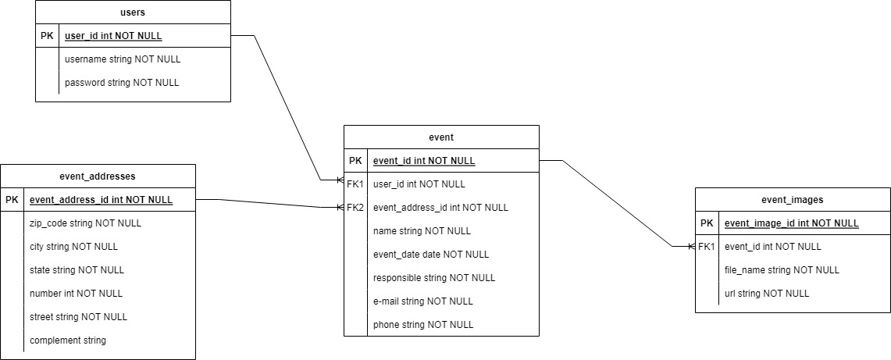

## Desafio - Gerenciador de eventos

- Para iniciar a aplicação, é necessário: Criar um .env e preencher os dados de acordo com o .env example, e usar a chave CLOUDINARY_URL passada por e-mail.

- Para executar os testes (e2e) da aplicação utilize o comando (OBS: os testes estão rodando no db local - portanto é necessário fazer a criação do db antes de rodar os testes)

```
yarn test
```

- Para rodar testes específicos:

```
yarn test test/auth/auth.e2e-spec.ts
yarn test test/events/events.e2e-spec.ts
yarn test test/users/users.e2e-spec.ts
```

- A documentação da API se encontra no link: http://localhost:3005/api

- Para o **upload de imagens** dos eventos, foi utilizado a API do
  <a href="https://cloudinary.com/">Cloudinary</a> para armazenar as imagens, retornando um link que é armazenado no banco de dados do projeto;

- Diagrama de entidades da aplicação:
- 
